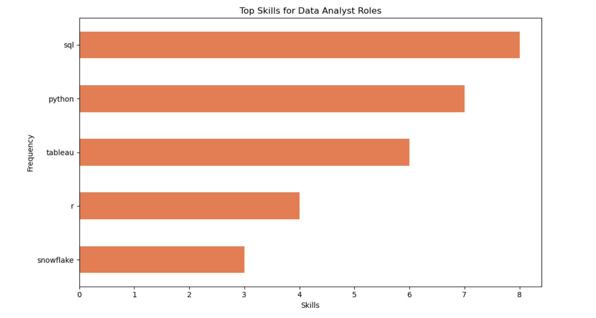

# Introduction
📊 Dive into the job market! Focusing on Data Analyst Roles, this project explores top-paying jobs 💰, in-demand skills 🔥, and where high demand meets high salary in the Data Analytics Position.

SQL Queries? Please check them out here: [sql_queries](/sql_queries/)

# Background
Driven by a quest to navigate the Data Analyst job market more effectively, this project was born from a desire to pinpoint top-paid and in-demand skills, streamlining others to find optimal jobs.

### Questions I wanted to answer through my SQL queries were:
1. Where are the top paying Data Analyst jobs?
2. What skills are required for these top-paying jobs?
3. What skills are the most in demand for Data Analysts?
4. Which skills are associated with higher salaries?
5. What are the most optical skills to learn?

# Tools I used
For my deep dive into the Data Analyst job market, I harnassed the power of several key tools:

- **SQL:** The backbone of my analysis, allowing me to query the database and unearth critical insights.
- **PostgreSQL:** The chosen database management system ideal for handling the job posting data.
- **Visual Studio Code:** My go-to for database management and executing SQL queries.
- **Git & GitHub:** Essential for version control and sharing my SQL scripts and analysis, ensuring collaboration and project tracking.

# The Analysis
Each query for this project aimed to investigate specific aspects of the data analyst job market. Here is how I approached each question:

### 1. Top Paying Data Analyst Jobs
This SQL query aims to retrieve the top 10 highest-paying job postings for Data Analyst positions that have location flexibility (listed as "Anywhere"). It filters out job postings with missing salary information and presents essential details such as job title, company name, location, schedule type, salary, and posting date.

```sql
SELECT 
    job_id,
    company_dim.name AS company_name,
    job_title,
    job_location,
    job_schedule_type,
    salary_year_avg,
    job_posted_date
FROM job_postings_fact
LEFT JOIN company_dim
    ON job_postings_fact.company_id = company_dim.company_id
WHERE 
    job_title_short = 'Data Analyst' AND
    job_location = 'Anywhere' AND
    salary_year_avg IS NOT NULL
ORDER BY salary_year_avg DESC
LIMIT 10;
```

Here is the breakdown of the top Data Analyst jobs in 2023:
- **Diverse Salary Range:** Top 10 paying Data Analyst roles span from $184,000 to $650,000, indicating significant salary potential in the field.
- **Wide Range of Employers:** Companies like Meta, AT&T, and SmartAsset are among those offering high salaries, showing a broad interest across different industries.
- **Job Title Variety:** There is a high diversity in job titles, from ERM Data Analyst to Associate Director - Data Insights, reflecting varied roles and specializations within Data Analytics. 

### 2. Skills for Top Paying Jobs
This SQL query aims to identify the skills required for the top-paying Data Analyst roles. It first selects the top 10 highest-paying Data Analyst job postings with location flexibility (listed as "Anywhere"). Then, it retrieves the associated company names, job titles, and average yearly salaries. In the subsequent part of the query, it joins these top-paying jobs with the skills required for each job. Finally, it presents the details of these top-paying jobs along with their required skills, ordered by salary in descending order.

```sql
WITH top_paying_jobs AS (
    SELECT 
        job_id,
        company_dim.name AS company_name,
        job_title,
        salary_year_avg
    FROM job_postings_fact
    LEFT JOIN company_dim
        ON job_postings_fact.company_id = company_dim.company_id
    WHERE 
        job_title_short = 'Data Analyst' AND
        job_location = 'Anywhere' AND
        salary_year_avg IS NOT NULL
    ORDER BY salary_year_avg DESC
    LIMIT 10
)

SELECT 
    top_paying_jobs.*,
    skills_dim.skills 
FROM top_paying_jobs
INNER JOIN skills_job_dim 
    ON top_paying_jobs.job_id = skills_job_dim.job_id
INNER JOIN skills_dim
    ON skills_job_dim.skill_id = skills_dim.skill_id
ORDER BY salary_year_avg DESC;
```


*Bar graph visualizing the top 5 skills for Data Analyst; Created this graph using Python in Jupiter Notebook.*

### 3. In-Demand Skills for Data Analysts
**All Job Postings Worldwide:** This query identifies the most in-demand skills across all Data Analyst and Data Scientist job postings globally. It counts the occurrences of each skill, joins relevant tables to fetch skill details, and groups the results by skill. The output is sorted by demand count in descending order, limited to the top 10 skills.

```sql
SELECT 
    skills_dim.skills,
    COUNT(skills_job_dim.job_id) AS demand_count
FROM job_postings_fact
INNER JOIN skills_job_dim 
    ON job_postings_fact.job_id = skills_job_dim.job_id
INNER JOIN skills_dim
    ON skills_job_dim.skill_id = skills_dim.skill_id
WHERE 
    job_title_short IN ('Data Analyst', 'Data Scientist')
GROUP BY skills_dim.skills
ORDER BY demand_count DESC
LIMIT 10;
```

**Job Postings in Australia:** Focused on Australian job postings, this query performs a similar analysis to the global query but filters for jobs located specifically in Australia. It counts the occurrences of skills required for Data Analyst and Data Scientist roles in Australia, groups them by skill, and sorts the results by demand count in descending order, limited to the top 10 skills.

```sql
SELECT 
    skills_dim.skills,
    COUNT(skills_job_dim.job_id) AS demand_count_aus
FROM job_postings_fact
INNER JOIN skills_job_dim 
    ON job_postings_fact.job_id = skills_job_dim.job_id
INNER JOIN skills_dim
    ON skills_job_dim.skill_id = skills_dim.skill_id
WHERE 
    job_title_short IN ('Data Analyst', 'Data Scientist') AND 
    job_country = 'Australia'
GROUP BY skills_dim.skills
ORDER BY demand_count_aus DESC
LIMIT 10;
```
Here is the breakdown of the most demanded skills for Data Analysts in 2023:
- **SQL** and **Excel** remain fundamental, emphasizing the need for strong foundational skills in data preprocessing and data manipulation. 
- **Programming** and **Visualization Tools** like **Python**, **R**, **Tabelau**, and **Power BI** are essential, pointing towards the increasing importance of technical skills in data storytelling and decision support.

| Skills | Demand Count | 
|-----------------|-----------------|
| SQL   | 171802    |
| R    | 89829    |
| Excel    | 84632    |
| Tableau    | 76067    |

*Table of the demand for the top 5 skills for Data Analysts.*

### 4. Skills Based on Salary
**All Job Postings (Global):** This query analyzes Data Analyst job postings globally. It calculates the average salary for each skill required in Data Analyst roles, rounds it to the nearest whole number, and groups the results by skill. The output is sorted by average salary in descending order and limited to the top 20 skills.

```sql
SELECT 
    skills_dim.skills,
    ROUND(AVG(salary_year_avg), 0) AS average_salary
FROM job_postings_fact
INNER JOIN skills_job_dim 
    ON job_postings_fact.job_id = skills_job_dim.job_id
INNER JOIN skills_dim
    ON skills_job_dim.skill_id = skills_dim.skill_id
WHERE 
    job_title_short = 'Data Analyst' AND
    salary_year_avg IS NOT NULL
GROUP BY skills_dim.skills
ORDER BY average_salary DESC
LIMIT 20;
```

**Remote Positions:** Focused on remote Data Analyst job opportunities, this query identifies the average salary for each skill required in remote positions. It filters for Data Analyst roles with remote work options, calculates the average salary for each skill, rounds it to the nearest whole number, and groups the results by skill. The output is sorted by average salary in descending order and limited to the top 20 skills.

```sql
SELECT 
    skills_dim.skills,
    ROUND(AVG(salary_year_avg), 0) AS average_salary_remote
FROM job_postings_fact
INNER JOIN skills_job_dim 
    ON job_postings_fact.job_id = skills_job_dim.job_id
INNER JOIN skills_dim
    ON skills_job_dim.skill_id = skills_dim.skill_id
WHERE 
    job_title_short = 'Data Analyst' AND
    salary_year_avg IS NOT NULL AND
    job_work_from_home = TRUE
GROUP BY skills_dim.skills
ORDER BY average_salary_remote DESC
LIMIT 20;
```

Here is the breakdown of top paying skills for Data Analysts in 2023:

**Emerging Technologies:** Golang appears in both global and remote postings, suggesting its growing popularity in the data analytics field. Remote postings also highlight the significance of Swift, Jupyter, and Pandas, indicating a shift towards technologies conducive to remote work environments.

**Data Analytics Tools:** PyTorch and TensorFlow feature prominently in both sets of postings, emphasizing the importance of deep learning frameworks in data analysis roles. Pandas and NumPy are essential tools in remote positions, underlining the significance of Python for data manipulation and analysis in distributed work settings.

Overall, the data suggests a growing demand for specialized skills such as deep learning frameworks, alongside a continued reliance on foundational tools like Python and infrastructure management technologies. 

| Skills | Average Salary | 
|-----------------|-----------------|
| SVN   | 400000    |
| Solidity    | 179000    |
| Couchbase    | 160515    |
| DataRobot    | 155486    |
| Golang    | 155000    |
*Top 5: Worlwide Job Postings Skills & Salaries.*

| Skills | Average Salary | 
|-----------------|-----------------|
| PySpark   | 208172    |
| Bitbucket    | 189155    |
| Jupiter    | 152777    |
| Pandas    | 151821    |
| Numpy    | 143513    |
*Top 5: Remote Job Postings Skills & Salaries.*

### 5. Most Optimal Skills to Learn
The query assesses skill demand and average salaries for Data Analyst roles. It calculates skill demand by counting job postings and computes the average salary per skill. Results include skill ID, name, demand count, and average salary, sorted by demand count and average salary, limited to the top 20 skills.

```sql
WITH skills_demand AS (
    SELECT 
        skills_dim.skill_id,
        skills_dim.skills,
        COUNT(skills_job_dim.job_id) AS demand_count
    FROM 
        job_postings_fact
    INNER JOIN skills_job_dim 
        ON job_postings_fact.job_id = skills_job_dim.job_id
    INNER JOIN skills_dim
        ON skills_job_dim.skill_id = skills_dim.skill_id
    WHERE 
        job_title_short = 'Data Analyst' AND
        salary_year_avg IS NOT NULL
    GROUP BY 
        skills_dim.skill_id
), 

avg_salary AS (
    SELECT 
        skills_dim.skill_id,
        ROUND(AVG(salary_year_avg), 0) AS average_salary
    FROM 
        job_postings_fact
    INNER JOIN skills_job_dim 
        ON job_postings_fact.job_id = skills_job_dim.job_id
    INNER JOIN skills_dim
        ON skills_job_dim.skill_id = skills_dim.skill_id
    WHERE 
        job_title_short = 'Data Analyst' AND
        salary_year_avg IS NOT NULL
    GROUP BY 
        skills_dim.skill_id
)

SELECT
    skills_demand.skill_id,
    skills_demand.skills,
    demand_count,
    average_salary
FROM skills_demand
INNER JOIN avg_salary
    ON skills_demand.skill_id = avg_salary.skill_id
ORDER BY 
    demand_count DESC, average_salary DESC
LIMIT 20;
```
| Skills | Demand Count | Average Salary | 
|-|-|-|
| SQL   | 3083    | 96435    | 
| Excel    | 2143    | 86419    | 
| Python    | 1840    | 101512    | 
| Tableau    | 1659    | 97978    | 
| R    | 1073    | 98708    | 
*Top 5 optimal skills to learn-Sorted by Demand Count*

# What I learned
Throughout this adventure, I have accumulated my SQL toolkit with some serious firepower:

- **🧩Complex Query Crafting:** Mastered the art of advanced SQL, merging tables like a pro and wielding WITH clauses for ninja-level temp table maneuvers.
- **📊Data Aggregation:** Got cozy with GROUP BY and turned aggregate functions like COUNT() and AVG() into my data-summarizing sidekicks.
- **🪄Analytical Wizardry:** Leveled up my real-world puzzle-solving skills, turning questions into actionable, insightful SQL queries.

# Conclusion

### Insights
1. **Top Paying Data Analyst Jobs:** The highest-paying jobs for Data Analysts that allow remote work offers a wide range of salaries, the highest of which is $650,000! 🤯.
2. **Skills for Top Paying Jobs:** High-paying Data Analyst jobs require advanced proficiency in SQL, suggesting it's a critical skill to acquire for a top salary.
3. **Most In-Demand Skills:** SQL is also the most demanded skill in the Data Analyst job market, thus making it essential for job seekers.
4. **Skills with Higher Salaries:** Specialized skills, such as SVN and Solidity, are associated with the highest average salaries, indicating a premium on niche expertise.
5. **Optimal Skills for Job Market Value:** SQL leads in demand and offers a high average salary, positioning it as one of the most optimal skills to learn for Data Analysts to maximize their market value.

### Closing Thoughts
This SQL project enhanced my SQL skills and provided valuable insights into the Data Analyst job market. The findings from the analysis serve as a guide to prioritizing skill development and job search efforts. Aspiring Data Analysts can better position themselves in a competitive job market by focusing on high-demand, high-salary skills. This exploration highlights the importance of continuous learning and adaptation to emerging trends in the field of Data Analytics.